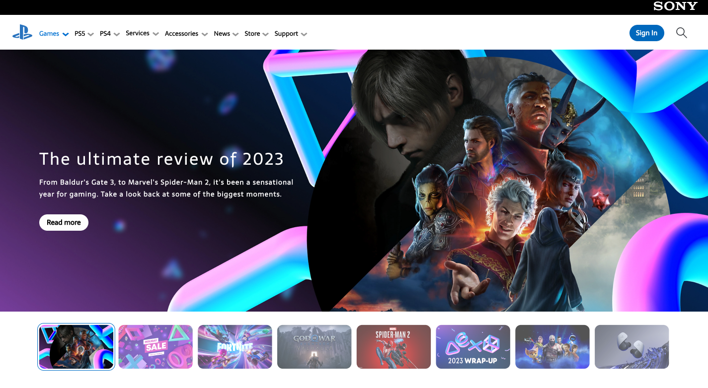

# 🎮 PlayStation-Inspired UI Design

A user interface project designed in Spring 2024, inspired by the PlayStation Store experience.  
The design showcases a clean visual hierarchy, intuitive navigation, and a modern aesthetic tailored for a gaming website.

---

## 🎨 Role

**UI/UX Designer**

- Designed an interactive interface using **Figma**
- Focused on layout, spacing, and visual hierarchy
- Presented the design in the university’s project exhibition
- Received positive feedback for creativity and clarity

---

## 🧰 Tools Used

- Figma (UI Design & Prototyping)
- Adobe Photoshop (Assets Editing)

---

## 📸 Screenshots

  

---

## 🔗 Design Link

[Figma Design (View Only)](https://www.figma.com/proto/eQZBvBAcImpxtSkyOdF1He/SONY-PLAYSTATION?page-id=0%3A1&node-id=829-1060&starting-point-node-id=829%3A1060&t=q9KPj6qmEuuZKr4K-1)

---

## 🧠 Skills Learned

- UI/UX principles  
- Wireframing & prototyping  
- User-focused visual hierarchy

---

## 👨‍💻 Author

**Yunes Al-Shamea**  
Final-year Software Engineering Student  
📧 younesalshammaa@gmail.com  
